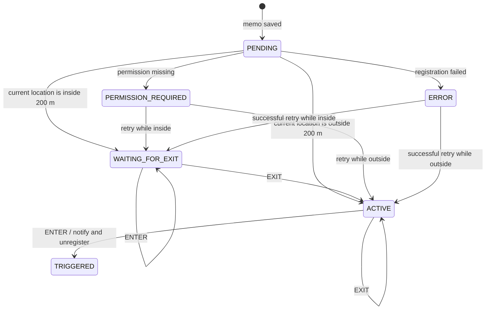

# Reminder lifecycle

Location Memo treats a reminder as a persisted state machine. The state is stored in Room, so process recreation, app replacement, and device reboot do not accidentally arm a reminder that still needs the user to leave its area.



## State semantics

| State | Meaning | Restoration behaviour |
| --- | --- | --- |
| `PENDING` | The memo was persisted but initial registration has not completed. | Reevaluate permissions and the current location, then schedule again. |
| `WAITING_FOR_EXIT` | The alert is scheduled, but an enter event must not notify until an exit has been observed. | Reschedule without reevaluating the current location. |
| `ACTIVE` | The alert is scheduled and the next enter event may notify. | Reschedule without changing the state. |
| `PERMISSION_REQUIRED` | At least one required location or notification permission is unavailable. No alert remains scheduled. | Retry registration when restoration runs. |
| `ERROR` | Android failed to register the proximity alert. | Retry registration when restoration runs. |
| `TRIGGERED` | The one-shot notification was delivered and the alert was removed. | Do not restore. |
| `INACTIVE` | A migrated legacy memo has no user-selected location. | Never register an alert. |

## Creating a memo inside its radius

The app commits the memo to Room before opening a runtime permission dialog or the system Settings screen. The memo ID, selected point, and creation stage are mirrored in `SavedStateHandle`; after process recreation, permission completion activates the existing row rather than attempting another insert. A denied permission leaves the persisted row in `PERMISSION_REQUIRED`.

`PERSISTING` covers only the Room insert; permission checks, the GPS lookup, and proximity registration run after its ID has been stored. If process recreation interrupts a transient stage, `PERSISTING` returns to an editable form and `ACTIVATING` returns to the repeatable activation step. Neither state remains disabled while waiting for a coroutine that belonged to the old process.

After all required permissions are available, the app asks Android for a current GPS fix before registering the proximity alert. If that fix is within the inclusive 200-metre radius, the memo is persisted as `WAITING_FOR_EXIT`.

An initial `ENTER` event is ignored in this state. The first `EXIT` event changes the state to `ACTIVE` without removing the platform alert. A later `ENTER` publishes the notification, changes the state to `TRIGGERED`, and removes the one-shot alert.

If Android cannot provide a current fix within five seconds, the reminder is armed as `ACTIVE`. This favours delivering the first real arrival over potentially waiting for an exit that Android never reported. Consequently, an immediate notification remains possible in the degraded no-fix case; the UI does not block memo creation.

## Restoration

- `WAITING_FOR_EXIT` is restored without reevaluating the current position, so process recreation cannot bypass the required exit.
- `ACTIVE` remains armed after restoration.
- `PENDING`, `PERMISSION_REQUIRED`, and `ERROR` are reevaluated against the current position when registration is retried.
- `TRIGGERED`, `INACTIVE`, and completed memos are not registered.

`TRIGGERED` and `INACTIVE` are also terminal for direct activation. A delayed Settings result therefore returns their current status without scheduling an alert or changing the database row.

Process-start, `BOOT_COMPLETED`, and `MY_PACKAGE_REPLACED` restoration is enqueued as unique WorkManager work, so a slow Room query or location lookup does not consume a `BroadcastReceiver` execution deadline. The home screen also performs an in-process retry when it resumes.

A batch takes at most one current GPS fix for all reminders that require position reevaluation. That lookup happens outside the mutex used for persistence and proximity-event transitions; each candidate is loaded again under the mutex before registration so a concurrent completion is not overwritten. If required permissions are missing, registration cancels any existing platform alert and persists `PERMISSION_REQUIRED`; this state is distinct from the permanent legacy `INACTIVE` state.

## Verification

Local unit tests cover state transitions, single-fix batch restoration, and creation-state recovery. Instrumentation tests exercise v1/v2-to-v3 Room migrations and reused details navigation. The GPX E2E suite covers both important device flows:

1. Start outside, create a memo, enter the radius, and receive one notification.
2. Start inside, create a memo, verify that no notification is posted, exit the radius, return, and then receive one notification.

Run both scenarios on a dedicated API 31+ Android Emulator:

```shell
./scripts/run-e2e.sh
```

## Platform reference

The implementation uses Android's [`LocationManager.addProximityAlert`](https://developer.android.com/reference/android/location/LocationManager#addProximityAlert(double,double,float,long,android.app.PendingIntent)). Entry and exit events are approximate: a brief boundary crossing can be missed, and location accuracy can produce an event near rather than strictly inside the configured radius.
