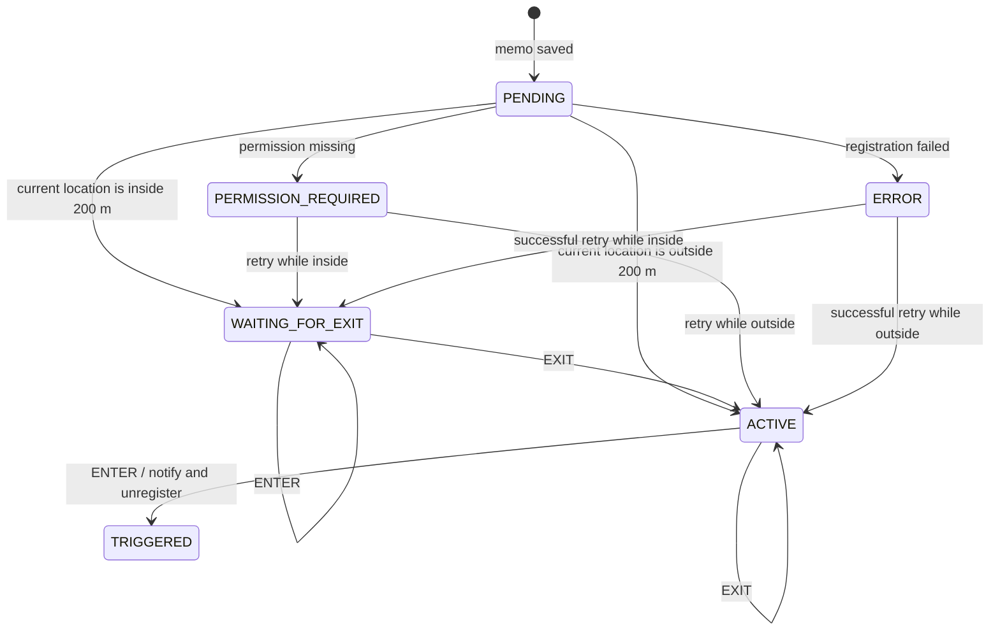

# Reminder lifecycle

Location Memo treats a reminder as a persisted state machine. The state is stored in Room, so process recreation, app replacement, and device reboot do not accidentally arm a reminder that still needs the user to leave its area.



## Creating a memo inside its radius

After all required permissions are available, the app asks Android for a current GPS fix before registering the proximity alert. If that fix is within the inclusive 200-metre radius, the memo is persisted as `WAITING_FOR_EXIT`.

An initial `ENTER` event is ignored in this state. The first `EXIT` event changes the state to `ACTIVE` without removing the platform alert. A later `ENTER` publishes the notification, changes the state to `TRIGGERED`, and removes the one-shot alert.

If Android cannot provide a current fix within five seconds, the reminder is armed as `ACTIVE`. This favours delivering the first real arrival over potentially waiting for an exit that Android never reported. Consequently, an immediate notification remains possible in the degraded no-fix case; the UI does not block memo creation.

## Restoration

- `WAITING_FOR_EXIT` is restored without reevaluating the current position, so process recreation cannot bypass the required exit.
- `ACTIVE` remains armed after restoration.
- `PENDING`, `PERMISSION_REQUIRED`, and `ERROR` are reevaluated against the current position when registration is retried.
- `TRIGGERED`, `INACTIVE`, and completed memos are not registered.

## Verification

Unit tests cover state transitions and restoration. The GPX E2E suite covers both important device flows:

1. Start outside, create a memo, enter the radius, and receive one notification.
2. Start inside, create a memo, verify that no notification is posted, exit the radius, return, and then receive one notification.

Run both scenarios on a dedicated API 31+ Android Emulator:

```shell
./scripts/run-e2e.sh
```

## Platform reference

The implementation uses Android's [`LocationManager.addProximityAlert`](https://developer.android.com/reference/android/location/LocationManager#addProximityAlert(double,double,float,long,android.app.PendingIntent)). Entry and exit events are approximate: a brief boundary crossing can be missed, and location accuracy can produce an event near rather than strictly inside the configured radius.
